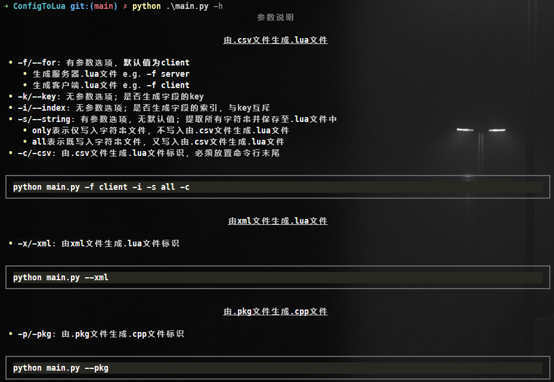

### Convert to `sth.`

#### 操作说明

1. 执行`pip install -r requirements.txt`
2. 配置 `.config`文件

   1. 第一行设置`.csv`文件路径，以`#`分割 e.g. `csv#E:\WorkSpace\XXX\config\Table\`
   2. 第二行设置`SkillData`文件路径，以`#`分割 e.g. `xml#E:\WorkSpace\XXX\config\Assets\Resources\SkillData`
   3. 第三行设置`tolua`文件路径，以`#`分割 e.g. `pkg#E:\WorkSpace\XXX\XXX\tolua`

3. 生成`lua`脚本，详见[参数说明](####参数说明)

    ```shell
    python main.py --xml # 将SkillData中的.txt文件转成.lua文件
    python main.py --csv # 将Table中的.csv文件转成.lua文件 
    ```
    

#### 参数说明

##### 由`.csv`文件生成`.lua`文件

* `-f/--for`：有参数选项，**默认值为`client`**
  * 生成服务器`.lua`文件 e.g. `-f server`
  * 生成客户端`.lua`文件 e.g. `-f client`
  
* `-k/--key`：无参数选项；是否生成字段的key

  

* `-i/--index`：无参数选项；是否生成字段的索引，与key互斥

  

* `-s/--string`：有参数选项，无默认值；提取所有字符串并保存至`.lua`文件中
  * `only`表示仅写入字符串文件，不写入由`.csv`文件生成`.lua`文件
  * `all`表示既写入字符串文件，又写入由`.csv`文件生成`.lua`文件

* `-c/-csv`：由`.csv`文件生成`.lua`文件标识，必须放置命令行末尾

```shell
python main.py -f client -i -s all -c
```

##### 由`xml`文件生成`.lua`文件

* `-x/-xml`：由`xml`文件生成`.lua`文件标识

```shell
python main.py --xml
```

##### 由`.pkg`文件生成`.cpp`文件

* `-p/-pkg`：由`.pkg`文件生成`.cpp`文件标识

```shell
python main.py --pkg
```

#### Features

##### 个性化输出

* 处理进度

  

  

* 说明文档

  
